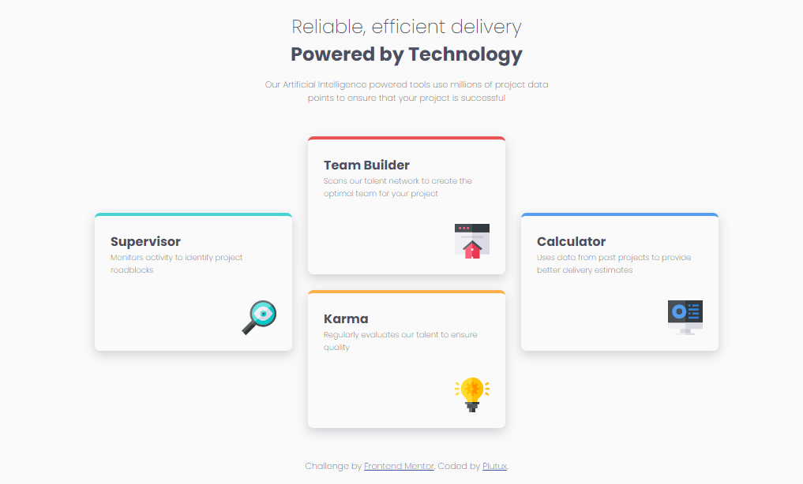

# Frontend Mentor - Four card feature section solution

This is a solution to the [Four card feature section challenge on Frontend Mentor](https://www.frontendmentor.io/challenges/four-card-feature-section-weK1eFYK). Frontend Mentor challenges help you improve your coding skills by building realistic projects.

## Table of contents

- [Design](#design)
- [Links](#links)
- [Author](#author)

### Design

### Links

- [Frontend Mentor Solution](https://www.frontendmentor.io/solutions/four-card-feature-section-qmxlrP7sn1)
- [Live Site](https://plutuxx.github.io/Four-card-feature-section.io/)

## Author

- Frontend Mentor - [@plutuxx](https://www.frontendmentor.io/profile/plutuxx)
